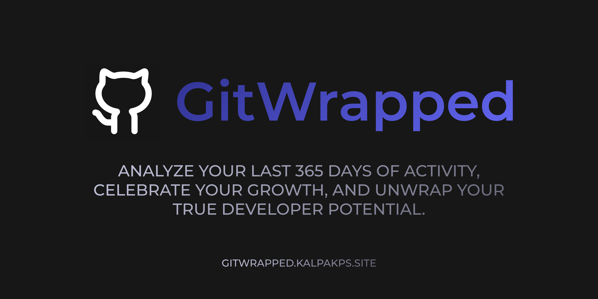

<div align="center">



### **Experience your GitHub stats like a cinematic masterpiece.**

[](https://vitejs.dev/)
[](https://react.dev/)
[](https://tailwindcss.com/)
[](https://www.framer.com/motion/)

---

**GitWrapped** transforms your year of code into a 7-chapter cinematic journey. Built for developers who value aesthetics as much as results.

[The Chapters](#-the-cinematic-chapters) • [Features](#-project-features) • [Power Logic](#-how-power-is-calculated) • [Developer Classes](#-developer-classes) • [Achievements](#-achievements) • [The Tiers](#-the-tiers)

</div>

---

## 🎬 The Cinematic Chapters

Your story is told through eight streamlined scenes:

1. 📊 **Stats Overview**: Your total Repos, PRs, and Issues at a glance.
2. ⚡ **Power Archetype**: Your developer tier and class based on coding performance.
3. 🧬 **Coding DNA**: A breakdown of your commit habits and temporal patterns.
4. 🥁 **Activity Rhythm**: High-fidelity visualization of your hourly pulse and weekly energy.
5. 🔥 **Contribution Heatmap**: A cinematic map of your yearly activity.
6. 🌠 **Community Impact**: Your stars, forks, and ecosystem reach.
7. 🏆 **Achievements**: Special milestones and badges unlocked during the year.
8. 🆔 **Digital Identity**: A final summary card ready for social sharing.

---

## 🔥 Project Features

| Feature | Description |
| :--- | :--- |
| **⚔️ Code Battle** | Compare stats with fellow developers in a real-time showdown. |
| **📊 Interactive Analytics** | High-fidelity charts and heatmaps that turn raw activity into visual stories. |
| **📸 One-Click Export** | Export your identity card as a high-quality image for social sharing. |
| **🔐 Private Stats** | Optional GitHub OAuth to include your private repository data in your recap. |

---

## ⚡ How Power is Calculated

Your **Power Level** isn't just a number—it's a weighted score based on your real-world impact over the last 365 days.

| Metric | Weight | Description |
| :--- | :--- | :--- |
| **Pull Requests** | `3.0x` | High-impact collaborative contributions. |
| **Repository Stars** | `5.0x` | Community validation and project reach. |
| **Commits** | `1.2x` | Foundation of your steady development work. |
| **Issues** | `1.5x` | Involvement in project management and bug fixing. |
| **Longest Streak** | `2.0x` | Dedication and daily coding consistency. |

> [!TIP]
> **Total Score** = `(Commits * 1.2) + (PRs * 3) + (Issues * 1.5) + (Total Stars * 5) + (Max Streak * 2)`

---

## 🎭 Developer Classes

Your **Class** is determined by your daily habits and repository impact.

| Class | Description | Requirement |
| :--- | :--- | :--- |
| **🦉 Night Owl** | You code while the world sleeps. | Activity peak 10PM - 4AM |
| **🌅 Early Bird** | You conquer the codebase before breakfast. | Activity peak 5AM - 9AM |
| **🤠 Midday Maverick** | Peak productivity during the bright hours. | Activity peak 12PM - 5PM |
| **🤝 The Socialite** | You favor collaboration and code reviews. | High PR to Commit ratio |
| **🤖 The Machine** | Unstoppable momentum. Half a year of non-stop code. | 180+ Day Streak |
| **🔨 The Grinder** | Relentless dedication to the craft. | 60+ Day Streak |
| **🏗️ The Architect** | You build things that the community values. | Repo with 500+ Stars |
| **⚡ The Sprinter** | Capable of massive bursts of productivity. | 20+ Commits in one day |
| **🌍 The Polyglot** | Master of many syntax, nomad of stacks. | 5+ Languages used |
| **💻 The Developer** | The foundation of the digital world. | Default Class |

---

## 🏆 Achievements

Special milestones that define your journey as a developer. Unlock them by reaching specific metrics during the year.

| Achievement | Description | Icon | Rarity |
| :--- | :--- | :--- | :--- |
| **git init** | First commit of the year. | ✨ | Common |
| **Night Shift** | 10+ commits after midnight. | 🌙 | Common |
| **Weekend Warrior** | 20+ commits on weekends. | 🛡️ | Common |
| **Streak Master** | Maintain a 30-day coding streak. | 🔥 | Rare |
| **Century Club** | 10+ commits in a single day. | 💯 | Rare |
| **Open Source Hero** | 5+ Pull Requests merged. | 🌟 | Rare |
| **Architect's Legacy** | Your projects have been forked 20+ times. | 🏛️ | Rare |
| **Total Explorer** | Contributed to 10+ different repositories. | 🧭 | Rare |
| **The 1%** | Reach 1,000+ total commits this year. | 👑 | Legendary |
| **Crab Whisperer** | Your primary coding language is Rust. | 🦀 | Legendary |
| **42** | You hit exactly 42 commits. The answer. | 🌌 | Legendary |
| **Comeback Kid** | Massive productivity spike after a quiet period. | 📈 | Legendary |

---

## 💎 The Tiers

Your total score determines your standing in the developer hierarchy.

| Tier | Score Range |
| :--- | :--- |
| **Mythic** | 10,000+ |
| **Legend** | 5,000+ |
| **Principal** | 2,500+ |
| **Senior** | 1,000+ |
| **Developer** | 500+ |
| **Apprentice** | 100+ |
| **Novice** | < 100 |


---

## 🛠️ Run Locally

Follow these steps to set up GitWrapped on your local machine:

### 1. Clone the Repository
```bash
git clone https://github.com/KalpakPS/GitWrapped.git
cd GitWrapped
```

### 2. Install Dependencies
```bash
npm install
```

### 3. Environment Setup

Create a `.dev.vars` file in the root directory for Cloudflare Workers variables:
```env
GITHUB_TOKEN=your_github_personal_access_token
GROQ_API_KEY=your_groq_api_key
```

### 4. Start Development Server
```bash
npm run dev
```

The application will be available at `http://localhost:5173`.

---

<div align="center">

### **Ready to see your wrapped?**

Crafted with ❤️ by **[KalpakPS](https://github.com/KalpakPS)**


</div>
